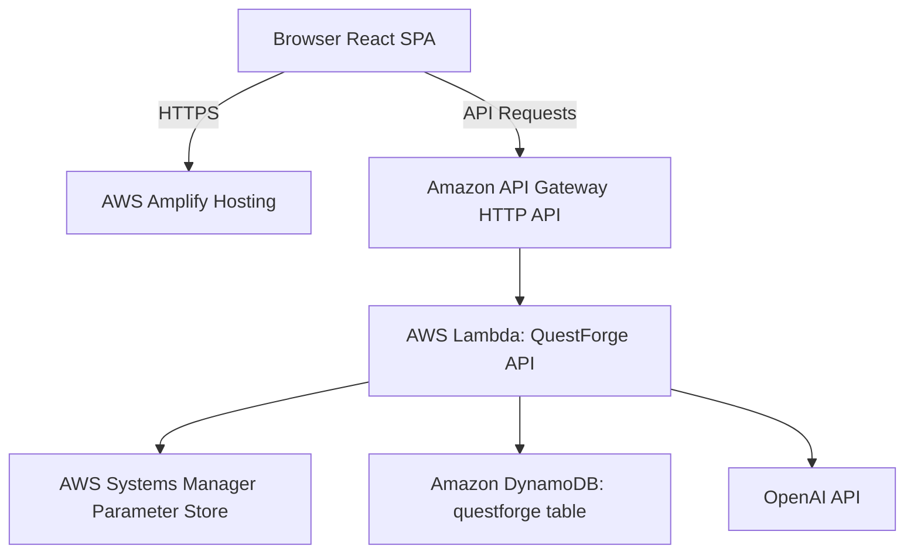

# Weekend Creative Challenge: QuestForge

## Vision: An Infinite Tapestry of Interactive Stories
QuestForge is a browser-based, AI-powered interactive text adventure that puts you at the center of an unfolding narrative. Designed for the AWS Builder Center "Weekend Creative Challenge", it is a choose-your-own-adventure engine where the world remembers.

The core differentiator of QuestForge is its **persistent world state**. Unlike typical chatbots that act as game masters but forget your actions three messages later, QuestForge maintains structured state: your health, gold, reputation, inventory, NPC dispositions, and discovered secrets. If you betray a merchant in Chapter 2, that merchant remembers your treachery in Chapter 7—not because the language model happened to remember, but because that disposition is formally tracked in a database and fed into the AI's context window.

The guiding philosophy of this project is simple: **The model writes prose. The application owns state.**

## How It Was Built
The core loop of QuestForge is straightforward: you choose a genre, select an archetype, and jump straight into the action. Every time you make a choice, the backend receives your decision, applies any state changes (like losing 10 health or gaining a rusted key), and prompts the AI for the next chapter.

The AI receives a tightly curated prompt containing:
1. The static genre and archetype descriptions.
2. A compact JSON representation of your stats, current inventory, and known NPC dispositions.
3. A rolling summary of the story so far.
4. Excerpts from the last two scenes.
5. The specific action you chose to take.

We strictly enforce the output shape using OpenAI's Structured Outputs (JSON Schema) and validate it on the server using `zod`. The model responds with the next story segment, updated state deltas (e.g., `-10 health`), new choices, and a rewritten rolling summary.

## AWS Services and Architecture Overview
The architecture is designed to be simple, robust, and cost-effective, leveraging serverless patterns.

1. **AWS Amplify Hosting**: Serves the React frontend. It provides continuous deployment directly from GitHub, SSL, and global CDN delivery, ensuring that a new player can jump into a game in under 20 seconds.
2. **Amazon API Gateway (HTTP API)**: Acts as the public edge for our backend, handling CORS and throttling to protect the downstream Lambda function.
3. **AWS Lambda**: The single compute unit containing our internal routing, validation logic, prompt assembly, OpenAI interaction, and state reducer.
4. **Amazon DynamoDB**: Stores all persistent data. We use a single-table design with a generic `pk` and `sk` to store session metadata, per-chapter immutable records, and atomic rate-limit counters. DynamoDB TTL automatically expires abandoned sessions.
5. **AWS Systems Manager (SSM) Parameter Store**: Securely stores the OpenAI API key (as a SecureString), ensuring it is never logged, hardcoded, or exposed in environment variables.

### The Elephant in the Room: Why OpenAI and not Amazon Bedrock?
Given this is an AWS challenge, using Amazon Bedrock for the generative AI component might seem expected. However, QuestForge relies heavily on guaranteed structured JSON outputs to safely update game state without manual parsing heuristics. At the time of this build, OpenAI's Structured Outputs provided the exact reliability required to ensure the model adhered strictly to the schema (returning valid arrays of choices and valid integer deltas for stats). AWS owns the infrastructure, the state, the storage, the compute, and the operations, while OpenAI serves solely as the creative prose engine.

## What Was Learned
Building QuestForge reinforced the value of decoupling creativity from state management. When you try to make an LLM handle arithmetic or long-term memory, hallucinations break the game. By forcing the LLM to return state deltas (e.g., "reputation - 5") and handling the arithmetic purely in application logic, the experience becomes bulletproof.

Furthermore, leveraging DynamoDB for both long-term storage (chapter history) and short-term operational data (rate limiting counters via atomic `ADD` operations) showcased the versatility of single-table design.

## Try It Out
You can play QuestForge right now!
**Live App:** [https://main.d19npu0tbmgk5j.amplifyapp.com/](https://main.d19npu0tbmgk5j.amplifyapp.com/)
