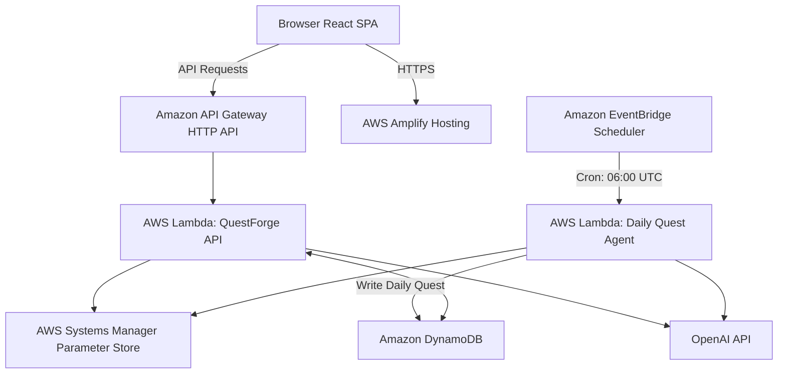

# Weekend Creative Agent Challenge: QuestForge
#agents

## Vision & What It Does
QuestForge is a browser-based, AI-powered interactive text adventure that puts you at the center of an unfolding narrative. Designed for the AWS Builder Center "Weekend Creative Agent Challenge", it is a choose-your-own-adventure engine where the world remembers.

To fulfill this week's challenge of turning the app into an **always-on agent**, QuestForge now autonomously generates a "Quest of the Day" every morning. This agent is scheduled to run daily without any user initiation, picking a new genre and archetype based on the day of the week, writing a fresh prologue and tagline, and making it available for returning players right on the landing page. The best tool is the one you never have to open—our players wake up to a brand new adventure ready to play.

The core differentiator of QuestForge remains its **persistent world state**. Unlike typical chatbots, QuestForge maintains structured state: your health, gold, reputation, inventory, NPC dispositions, and discovered secrets. The guiding philosophy is simple: **The model writes prose. The application owns state.**

## How You Built It
The core loop of QuestForge is straightforward: you choose a genre, select an archetype, and jump straight into the action. Every time you make a choice, the backend receives your decision, applies any state changes, and prompts the AI for the next chapter.

For the **Daily Quest Agent**, I built a dedicated AWS Lambda function triggered on a cron schedule by Amazon EventBridge Scheduler. This function determines the theme for the day (e.g., Deep Space/Scholar on Tuesdays), prompts the LLM to write a 150-word prologue with a catchy title and tagline, and saves the output to DynamoDB. The React frontend was updated to query this daily quest and display it prominently on the landing page.

One of the key challenges was ensuring the agent ran completely autonomously. By decoupling the generation step from the user request, the player experiences zero latency when discovering the new daily quest. 

## AWS Services Used / Architecture Overview
The architecture is designed to be simple, robust, and cost-effective, leveraging serverless patterns.



1. **AWS Amplify Hosting**: Serves the React frontend.
2. **Amazon API Gateway (HTTP API)**: Acts as the public edge for our backend.
3. **AWS Lambda**: Powers both the interactive game API and the scheduled Daily Quest Agent.
4. **Amazon DynamoDB**: Stores all persistent data, including game sessions and the newly generated daily quests.
5. **Amazon EventBridge Scheduler**: Autonomously triggers the daily quest generation.
6. **AWS Systems Manager (SSM) Parameter Store**: Securely stores the OpenAI API key.

## What You Learned
Building the always-on agent for QuestForge reinforced the value of asynchronous content generation. By shifting the creative load from a synchronous user request to a scheduled background job, the perceived performance for the user improves dramatically. I also learned how incredibly easy it is to wire up EventBridge Scheduler to a Lambda function to create reliable, autonomous agents.

### Proof of the Always-On Agent

**The EventBridge Schedule running the agent autonomously every day at 6:00 AM UTC (from our SAM template):**
```yaml
  DailySchedule:
    Type: AWS::Scheduler::Schedule
    Properties:
      ScheduleExpression: cron(0 6 * * ? *)
      FlexibleTimeWindow:
        Mode: FLEXIBLE
        MaximumWindowInMinutes: 15
      Target:
        Arn: !GetAtt DailyAgentFunction.Arn
        RoleArn: !GetAtt DailyAgentFunctionDailyScheduleRole.Arn
```

**The Agent executing and writing directly to the database without user interaction:**
```typescript
export const handler = async (event: any): Promise<void> => {
  // ... (Agent determines daily theme) ...

  const systemPrompt = `You are a creative writer...`;
  const completion = await openai.chat.completions.create({
    model: 'gpt-4o-mini',
    messages: [{ role: 'system', content: systemPrompt }],
  });

  // Save the result directly to the global world state
  const questData = JSON.parse(completion.choices[0].message.content || '{}');
  await docClient.send(
    new PutCommand({
      TableName: TABLE_NAME,
      Item: {
        pk: 'DAILY_QUEST',
        sk: `DATE#${dateStr}`,
        ...questData,
      },
    })
  );
};
```

**The final result waiting for the user when they open the app:**


## Link to App or Repo
**Live App:** [https://main.d19npu0tbmgk5j.amplifyapp.com/](https://main.d19npu0tbmgk5j.amplifyapp.com/)
